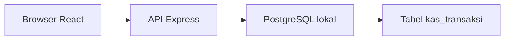
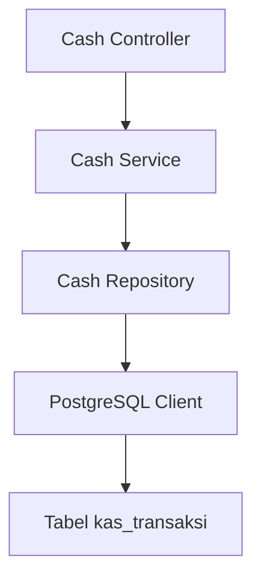
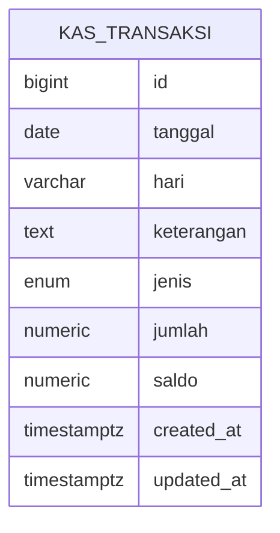

## 1. Desain Arsitektur


## 2. Deskripsi Teknologi
- Frontend: React 18 + TypeScript + Tailwind CSS + Zustand + React Router
- Backend: Express + TypeScript + Node.js
- Inisialisasi proyek: `vite-init` dengan template `react-express-ts`
- Database: PostgreSQL lokal dengan tabel `kas_transaksi`
- Validasi data: validasi request sederhana di backend sebelum insert ke database

## 3. Definisi Rute
| Rute | Tujuan |
|------|--------|
| / | Halaman utama pencatatan kas, ringkasan saldo, input transaksi, dan daftar mutasi. |

## 4. Definisi API
```ts
type CashType = 'masuk' | 'keluar'

interface CashTransaction {
  id: number
  tanggal: string
  hari: string
  keterangan: string
  jenis: CashType
  jumlah: number
  saldo: number
  created_at: string
  updated_at: string
}

interface CashSummaryResponse {
  saldoTerakhir: number
  totalMasuk: number
  totalKeluar: number
  jumlahTransaksi: number
}

interface CashListResponse {
  items: CashTransaction[]
  summary: CashSummaryResponse
}

interface CreateCashTransactionRequest {
  tanggal: string
  keterangan: string
  jenis: CashType
  jumlah: number
}
```

- `GET /api/cash/transactions?startDate=YYYY-MM-DD&endDate=YYYY-MM-DD`
  - Mengambil daftar mutasi kas dan ringkasan berdasarkan filter opsional.
- `POST /api/cash/transactions`
  - Menyimpan transaksi baru ke `kas_transaksi`.
- `GET /api/cash/summary`
  - Mengambil ringkasan saldo global tanpa filter.

## 5. Diagram Arsitektur Server


## 6. Model Data
### 6.1 Definisi Model Data


### 6.2 Data Definition Language
Sumber struktur database berada pada file [kas.sql](file:///e:/Project/kas/db/kas.sql) yang sudah dijalankan sebelumnya.

DDL inti yang dipakai:

```sql
CREATE TABLE IF NOT EXISTS kas_transaksi (
    id BIGSERIAL PRIMARY KEY,
    tanggal DATE NOT NULL,
    hari VARCHAR(10) NOT NULL,
    keterangan TEXT NOT NULL,
    jenis kas_jenis NOT NULL,
    jumlah NUMERIC(14,2) NOT NULL CHECK (jumlah > 0),
    saldo NUMERIC(14,2) NOT NULL DEFAULT 0,
    created_at TIMESTAMPTZ NOT NULL DEFAULT NOW(),
    updated_at TIMESTAMPTZ NOT NULL DEFAULT NOW()
);
```

Keputusan implementasi:
- Backend memakai koneksi PostgreSQL langsung melalui environment variable.
- Frontend tidak mengakses database secara langsung.
- Filtering data dilakukan di API agar tabel browser tetap ringan.
- Insert data mengandalkan trigger database untuk mengisi `hari` dan menghitung `saldo`.
