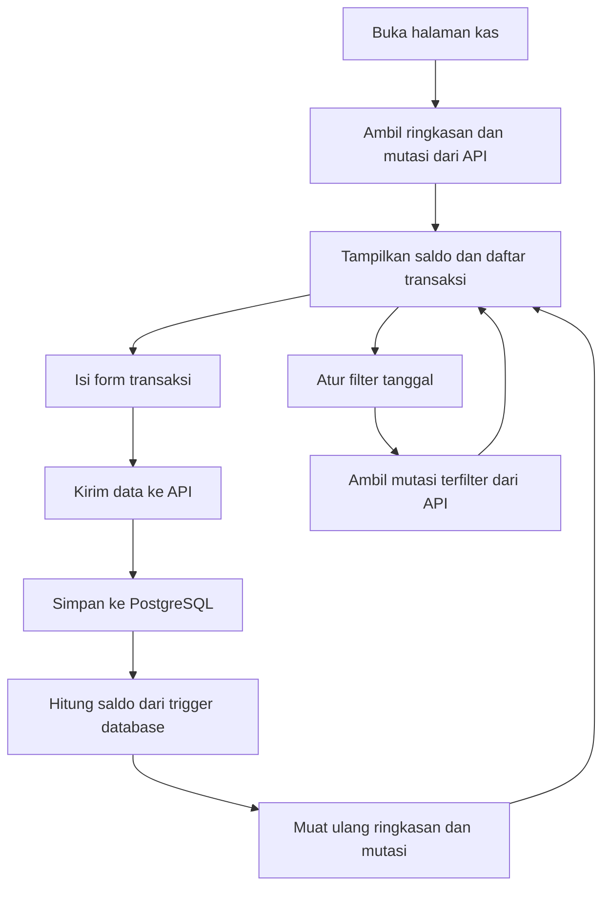

## 1. Gambaran Produk
Aplikasi web ini dipakai untuk mencatat arus kas harian secara cepat ke tabel PostgreSQL `kas_transaksi` yang sudah tersedia.
- Fokus utama produk adalah input transaksi masuk/keluar, melihat saldo berjalan, dan meninjau riwayat mutasi dengan alur yang sederhana.
- Nilai produk terletak pada pencatatan kas yang ringan, cepat dipakai, dan mudah dipreview dari browser lokal.

## 2. Fitur Inti

### 2.1 Modul Fitur
1. **Halaman Kas**: ringkasan saldo, form input transaksi, daftar mutasi, dan filter tanggal.

### 2.2 Detail Halaman
| Nama Halaman | Nama Modul | Deskripsi Fitur |
|--------------|-------------|-----------------|
| Halaman Kas | Header ringkasan | Menampilkan saldo terakhir, total pemasukan, total pengeluaran, dan jumlah transaksi. |
| Halaman Kas | Form transaksi | Input tanggal, keterangan, jenis transaksi, dan jumlah lalu simpan ke database. |
| Halaman Kas | Filter mutasi | Menyaring data berdasarkan tanggal awal dan tanggal akhir. |
| Halaman Kas | Tabel mutasi | Menampilkan tanggal, hari, keterangan, jenis, jumlah, dan saldo berjalan secara kronologis. |
| Halaman Kas | Informasi status | Menampilkan pesan sukses, gagal, dan loading untuk aksi ambil data atau simpan transaksi. |

## 3. Proses Inti
Pengguna membuka halaman kas, melihat ringkasan saldo, lalu mengisi form transaksi. Setelah transaksi disimpan, daftar mutasi dan kartu ringkasan diperbarui dari data database yang terbaru. Pengguna juga dapat memfilter rentang tanggal untuk melihat mutasi tertentu.

## 4. Desain Antarmuka
### 4.1 Gaya Desain
- Warna utama: latar terang tulang dengan aksen hijau tua dan emas kusam untuk nuansa kas buku besar modern.
- Gaya tombol: sudut membulat sedang, solid, dengan bayangan halus dan hover kontras.
- Tipografi: judul memakai serif editorial berkarakter, isi memakai sans modern yang rapat dan mudah dibaca.
- Tata letak: desktop-first, dua kolom padat; ringkasan dan form di atas, tabel mutasi lebar di bawah.
- Gaya ikon: ikon garis sederhana dari set modern untuk memperjelas saldo, pemasukan, pengeluaran, dan filter.

### 4.2 Gambaran Desain Halaman
| Nama Halaman | Nama Modul | Elemen UI |
|--------------|-------------|-----------|
| Halaman Kas | Header ringkasan | Kartu metrik kontras tinggi, angka besar, label kecil, highlight saldo aktif. |
| Halaman Kas | Form transaksi | Panel padat dengan grid 2 kolom, radio/segmented control untuk jenis, input nominal besar, tombol simpan menonjol. |
| Halaman Kas | Filter mutasi | Input tanggal ringkas, tombol reset, dan chip status hasil filter. |
| Halaman Kas | Tabel mutasi | Header sticky, baris zebra halus, badge jenis transaksi, angka rata kanan, saldo tebal. |

### 4.3 Responsivitas
- Pendekatan desktop-first dengan adaptasi mobile.
- Pada layar kecil, kartu ringkasan menjadi stack vertikal, form menjadi satu kolom, dan tabel memakai scroll horizontal.
- Area input dibuat rapat dan efisien agar nyaman untuk operasional harian.
